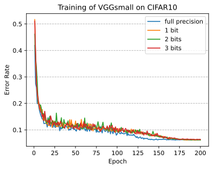
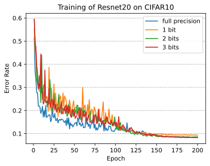

# Weight Search for Quantized Deep Neural Networks
---
This repository applies the catetorical searching method to solve the problem of training a weight-quantized neural network, where each quantized weight is represented by a discrete node with the value candidates being the output of the node.
___

### Usage
1. To train a neural network from scratch  
    ```
    python train.py -a [name of network] -d [name of dataset] \
                    -p [dataset folder] \
                    --training-json [json file containing training parameters]
    ```

    For example, the followng command is for training vgg_small on CIFAR10:  
    ```
    python train.py -a vgg_small -d cifar10 -p data/CIFAR10/ \
                    --train-json json/training/vggsmall-200.json
    ```

2. To search the weight value in a preset value space, turn on *--quantize-network* flag and *--quant-json* to include the quantization-defining json file. For example, to search the weight values for resnet18 in [-1, 1], use the following command
    ```
    python train.py -a resnet18 -d imagenet -p /dataset/imagenet/ \
                    --train-json json/training/resnet18-200.json \
                    --quant-json json/qiantization/1b.json \
                    --quantize-network
    ```

3. Distributed training on multiple GPUs:  
    ```
    python -m torch.distributed.launch --nproc_per_node=[#GPUs] \
        train.py -a resnet18 -d imagenet -p /dataset/imagenet/ \
                 --train-json json/training/resnet18-200.json \
    ```

4. There are some other optional arguments to help conducting the experiment:  
    - --verbose: display the progress of training during each epoch;  
    - --save: save the training result including loss accuracy and time for each epoch during both training and validation phases, and the model state;
    - --quantize-first-layer/quantize-last-layer: quantize the first/last layer of the model, which are not quantized by default;  
    - -o, --work-dir: directory for saving the output.
    
___
### Experiment Results
1. CIFAR10  

| Network | #Bits | Value Space | Accuracy (%) | Epoch Time |
| :-----: | :----: | :----: | :----: | :----: |
| ResNet20 | FP32<br>1<br>2<br>3 | R<br>{-1, 1}<br>{±1, ±1/2}<br>{±1/4, ±1/2, ±1, ±2} | 91.77<br>90.70<br>91.52<br>? |
| VGG-small | FP32<br>1<br>2<br>3 | R<br>{-1, 1}<br>{±1, ±1/2}<br>{±1/4, ±1/2, ±1, ±2} | 93.87<br>93.91<br>93.83<br>93.68|

2. Imagenet

| Network | #Bits | Value Space | Acc@1 (%) | Acc@5 (%) | Epoch Time |
| :-----: | :----: | :----: | :----: | :----: | :----: |
| ResNet18 | FP32<br>1<br>2<br>3 | R<br>{-1, 1}<br>{±1, ±1/2}<br>{±1/4, ±1/2, ±1, ±2} | | |

3. Diagram of Training Curves  

   CIFAR10

    
   

   ImageNet

   
   
